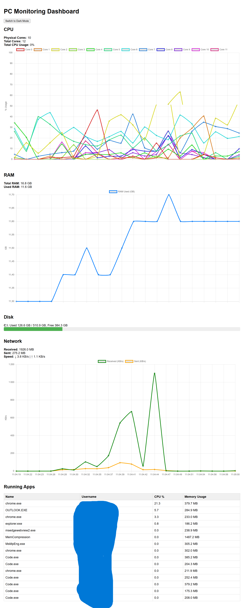
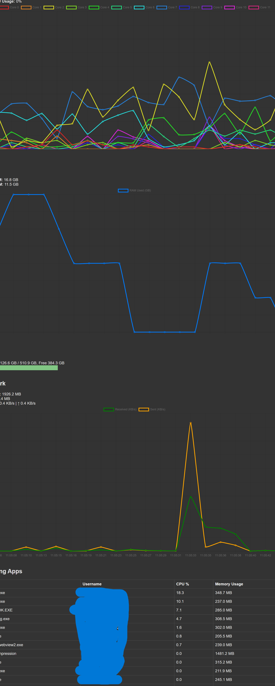

# PC Monitoring Dashboard
An app that collects data on your pc using APIs(cpu usage, ram usage, running apps...) and sends it to a dashbord that displays it all. I use a tablet that i put in my desk next to my computer and it continuously displays the dashboard with all the data i need. 

## Features

- Responsive login form with username and password fields
- Sends login credentials securely via POST request as JSON. A token with a set expiry date is generated at login and used with every request. When the token expires, you need to re-login.
- A protection against brute force attacks by adding a time wait between failed logins.
- A responsive dashboard with charts that fetches the data and displays it continuously. There is also a dark mode.

## Usage

1. Run your Flask backend on `http://localhost:5000`.
2. Open `dashboard.html` in your browser. You will be redirected to `login.html` since you don't have a token.
3. Enter valid credentials and submit.
4. On success, you’ll be redirected to `dashboard.html`.

## Technologies

- Frontend: HTML, CSS, JavaScript (Fetch API)
- Backend: Python Flask
- Token-based authentication

